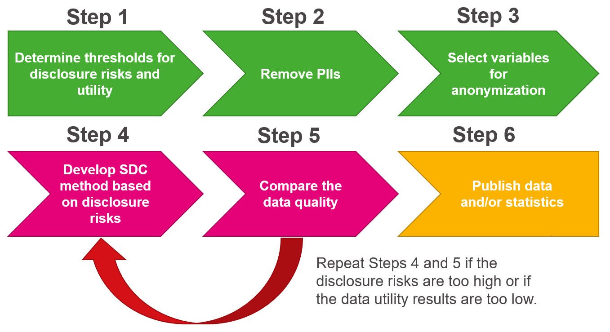
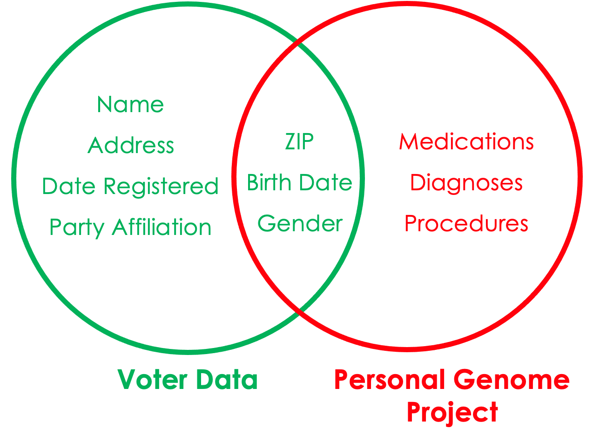

```{=html}
<style>
@import url('https://fonts.googleapis.com/css?family=Lato&display=swap');
</style>
```
<link rel="stylesheet" href="//fonts.googleapis.com/css?family=Lato" />

```{r header-image, fig.width = 5.14, fig.height = 1.46, echo = FALSE}

# All defaults
knitr::include_graphics(here::here("www", "images", "urban-institute-logo.png"))

```

# Introduction to Data Privacy

```{r rmarkdown-setup, echo = FALSE}
knitr::opts_chunk$set(warning = FALSE)
knitr::opts_chunk$set(message = FALSE)
knitr::opts_chunk$set(echo = FALSE)
```

```{r setup}
options(scipen = 999)
library(tidyverse)
library(palmerpenguins)
library(kableExtra)
library(gt)


# Helper function to create nice gt tables
create_table <- function(data_df, 
                         rowname_col = NA,
                         fig_num = "",
                         title_text = ""){
  # random_id = random_id(n=10)
  random_id = "urban_table"
  
  basic_table = data_df %>% 
    gt(id = random_id, rowname_col = rowname_col) %>% 
    tab_options(#table.width = px(760),
                table.align = "left", 
                heading.align = "left",
                # TODO: Discuss with Comms whether border should extend across 
                # whole row at bottom or just across data cells
                table.border.top.style = "hidden",
                table.border.bottom.style = "transparent",
                heading.border.bottom.style = "hidden",
                # Need to set this to transparent so that cells_borders of the cells can display properly and 
                table_body.border.bottom.style = "transparent",
                table_body.border.top.style = "transparent",
                # column_labels.border.bottom.style = "transparent",
                column_labels.border.bottom.width = px(1),
                column_labels.border.bottom.color = "black",
                # row_group.border.top.style = "hidden",
                # Set font sizes
                heading.title.font.size = px(13),
                heading.subtitle.font.size = px(13),
                column_labels.font.size = px(13),
                table.font.size = px(13),
                source_notes.font.size = px(13),
                footnotes.font.size = px(13),
                # Set row group label and border options
                row_group.font.size = px(13),
                row_group.border.top.style = "transparent",
                row_group.border.bottom.style = "hidden",
                stub.border.style = "dashed",
                ) %>% 
    tab_header(
      title = fig_num,# "eyebrow",
      subtitle = title_text) %>%  #"Top 10 Banks (by Dollar Volume) for Community Development Lending") %>% 
    # Bold title, subtitle, and columns
    tab_style(
      style = cell_text(color = "black", weight = "bold", align = "left"),
      locations = cells_title("subtitle")
    ) %>% 
    tab_style(
      style = cell_text(color = "#696969", weight = "normal", align = "left", transform = "uppercase"),
      locations = cells_title("title")
    ) %>% 
    tab_style(
      style = cell_text(color = "black", weight = "bold", size = px(13)),
      locations = cells_column_labels(gt::everything())
    ) %>% 
    # Italicize row group and column spanner text
    tab_style(
      style = cell_text(color = "black", style = "italic", size  = px(13)),
      locations = gt::cells_row_groups()
    ) %>% 
    tab_style(
      style = cell_text(color = "black", style = "italic", size  = px(13)),
      locations = gt::cells_column_spanners()
    ) %>% 
    opt_table_font(
        font = list(
          google_font("Lato"),
          default_fonts()
        )
      ) %>% 
    # Adjust cell borders for all cells, small grey bottom border, no top border
    tab_style(
      style = list(
        cell_borders(
          sides = c("bottom"),
          color = "#d2d2d2",
          weight = px(1)
        )
      ),
      locations = list(
        cells_body(
          columns =  gt::everything()
          # rows = gt::everything()
        )
      )
    )  %>%
    tab_style(
      style = list(
        cell_borders(
          sides = c("top"),
          color = "#d2d2d2",
          weight = px(0)
        )
      ),
      locations = list(
        cells_body(
          columns =  gt::everything()
          # rows = gt::everything()
        )
      )
    )  %>%
    # Set missing value defaults
    fmt_missing(columns = gt::everything(), missing_text = "—") %>%
    # Set css for all the things we can't finetune exactly in gt, mostly t/r/b/l padding
    opt_css(
      css = str_glue("
      #{random_id} .gt_row {{
        padding: 5px 5px 5px 5px;
      }}
      #{random_id} .gt_sourcenote {{
        padding: 16px 0px 0px 0px;
      }}
      #{random_id} .gt_footnote {{
        padding: 16px 0px 0px 0px;
      }}
      #{random_id} .gt_subtitle {{
        padding: 0px 0px 2px 0px;
      }}
      #{random_id} .gt_col_heading {{
        padding: 10px 5px 10px 5px;
      }}
      #{random_id} .gt_col_headings {{
        padding: 0px 0px 0px 0px;
        border-top-width: 0px;
      }}
      #{random_id} .gt_group_heading {{
        padding: 15px 0px 0px 0px;
      }}
      #{random_id} .gt_stub {{
        border-bottom-width: 1px;
        border-bottom-style: solid;
        border-bottom-color: #d2d2d2;
        border-top-color: black;
        text-align: left;
      }}
      #{random_id} .gt_grand_summary_row {{
        border-bottom-width: 1px;
        border-top-width: 1px;
        border-bottom-style: solid;
        border-bottom-color: #d2d2d2;
        border-top-color: #d2d2d2;
      }}
      #{random_id} .gt_summary_row {{
        border-bottom-width: 1px;
        border-top-width: 1px;
        border-bottom-style: solid;
        border-bottom-color: #d2d2d2;
      }}
      #{random_id} .gt_column_spanner {{
        padding-top: 10px;
        padding-bottom: 10px;
      }}
      ") %>% as.character()
    )
  
  return(basic_table)
}
```

<br>

# Why is Data Privacy important?

-   Modern computing and technology has made collecting and processing large amounts of data easy.

-   But, with that computing power, malicious actors can now easily reidentify individuals by linking supposedly anonymized records with public databases.

-   This kind of attack is called a "record linkage" attack. The following are some examples of famous record linkage attacks.

    -   In 1997, MA Gov. Bill Weld announced the public release of insurance data for researchers. He assured the public that PII had been deleted. A few days later Dr. Latanya Sweeney, then a MIT graduate student, mailed to Weld's office his personal medical information. She purchased voter data and linked Weld's birth date, gender and zip code to his health records. And this was back in 1997, when computing power was miniscule, and social media didn't exist!

    -   A study by Dr. Latayna Sweeney based on the 1990 Census [@sweeney2000simple] found that the 87% of the US population had reported characteristics that likely made them unique based only on ZIP, gender, and date of birth.

-   At the same time, releasing granular data can be of immense value to researchers. For example, cell phone data are invaluable for contact tracing, and granular medical data will lead to better treatment and development of cures. {width="310"}

-   More granular data are also important for understanding equity, particularly for smaller populations and subgroups.

<br>

<br>

# What is Data Privacy?

-   **Data Privacy:** the right of individuals to have have control over their sensitive information.

    -   There are differing notions of what should and shouldn't be private, which may include being able to opt out of privacy protections.

-   Data Privacy is a broad topic, which includes data security, encryption, access to data, etc.

    -   We will not be covering privacy breaches from unauthorized access to a database (i.e., hackers).

    -   We are instead focused on privacy preserving access to data.

-   Although data privacy and data confidentiality are certainly related, they are different, and both play a role in limiting statistical disclosure risk. 

    -   **Privacy:** the ability "to determine what information about ourselves we will share with others" [@fellegi1972question].

    -   **Confidentiality:** "the agreement, explicit or implicit, between data subject and data collector regarding the extent to which access by others to personal information is allowed" [@fienberg2018statistical].

-   There is often a tension between privacy and data utility (or usefulness). This tension is often referred to in the data privacy literature as the “privacy-utility trade-off.”

    -   **Data utility, quality, accuracy, or usefulness:** how practically useful or accurate to the data are for research and analysis purposes. 

    -   Generally higher utility = more privacy risks and vice versa.

-   In the data privacy ecosystem there are the following stakeholders:

    -   **Data users:** Those who consume the data, e.g., researchers, decisionmakers, etc.

    -   **Data maintainers** (aka data stewards/data owners): Those who own the data and are responsible for its safekeeping.

-   In addition, there are many version of the data we should define:

    -   **Original dataset:** the uncleaned, unprotected version of the data, such as the raw census microdata, which are never publicly released. 

    -   **Confidential dataset:** the cleaned version (meaning edited for inaccuracies or inconsistencies) of the data; often referred to as the gold standard or actual data for analysis. For example, the Census Edited File that is the final confidential data for the 2020 Census. This dataset is never publicly released but may be made available to others who are sworn to protect confidentiality and who are provided access in a secure environment, such as a Federal Statistical Research Data Center. 

    -   **Public dataset:** the publicly released version of the confidential data, such as the US Census Bureau’s public tables and datasets.

<br>

<br>

# Data Privacy Workflow

-   Data users have traditionally gotten access to data via:

    a)  direct access to the confidential data if they are trusted users (e.g., obtaining Special Sworn Status to use the Federal Statistical Research Data Centers). 

    b)  Access to public data or statistics, such as public microdata and summary tables, that are produced by data curators and modified to protect confidentiality.

-   The latter is how most data users gain access to information from confidential data and what we will focus on for this course. To create public data or statistics, data curators rely on statistical disclosure control (SDC) methods to preserve data confidentiality. The process of releasing this information publicly often involves the steps shown in figure 4.

-   Generally releasing confidential data involves the following steps to protect privacy:

    {width="518"}

<br>

# Overview of SDC

-   **Statistical Disclosure Control (SDC)** or Statistical Disclosure Limitation (SDL) is a field of study that aims to develop methods for releasing high-quality data products while preserving data confidentiality as a means of maintaining privacy. 

-   SDC methods have existed within statistics and the social sciences since the mid-twentieth century.

-   Below is an opinionated, and incomplete overview of various SDC methods. For this set of trainings, we will focus in-depth on the methods in yellow.

```{r sdc_overview_mmd, echo = FALSE, eval = T}

# color code things that can be formally private

DiagrammeR::mermaid("
graph TB
  B(SDC Methods)-->D(Synthetic Data)
  B-->E(Suppression)
  B-->F(Swapping)
  B-->H(Generalization)
  B-->I(Noise Infusion)
  B-->J(Sampling)
  D-->K(Partial)
  D-->L(Full)
  style D fill:#fdbf11;
  style K fill:#fdbf11
  style L fill:#fdbf11
",
height = 250,
width = 800)
```

-   Definitions of a few methods we won't cover in detail. See @matthews2011data for more information.

    -   **Suppression:** Not releasing data about certain subgroups.

    -   **Swapping:** The exchange of sensitive values among sample units with similar characteristics.

    -   **Generalization:** Aggregating variables into larger units (e.g., reporting state rather than zip code) or top/bottom coding (limiting values below/above a threshold to the threshold value).

    -   **Noise Infusion:** Adding random noise, often to continuous variables which can maintain univariate distributions.

    -   **Sampling:** Only releasing a sample of individual records.

-   Problem with the above approaches is that it really limits the utility of the data.

    -   Mitra and Reiter (2006) found that a 5 percent swapping of 2 identifying variables in the 1987 Survey of Youth in Custody invalidated statistical hypothesis tests in regression.

    -   Top/bottom coding eliminates information at the tails of the distributions, degrading analyses that depend on the entire distribution (Fuller 1993; Reiter, Wang, and Zhang, 2014).

-   A newer development in the SDC field with the potential to overcome some of these problems is Synthetic Data, which we will discuss further in part 2.

<br>

<br>

# Measuring Utility Metrics and Disclosure Risks

## Disclosure Risks

-   Generally there are 3 kinds of disclosure risk:

    1.  **Identity disclosure risk:** occurs if the data intruder associates a known individual with a public data record (e.g., a record linkage attack or when a data adversary combines one or more external data sources to identify individuals in the public data).

        {width="344"}

    2.  **Attribute disclosure risk:** occurs if the data intruder determines new characteristics (or attributes) of an individual based on the information available through public data or statistics (e.g., if a dataset shows that all people age 50 or older in a city are on Medicaid, then the data adversary knows that any person in that city above age 50 is on Medicaid). 

    3.  **Inferential disclosure risk:** occurs if the data intruder predicts the value of some characteristic from an individual more accurately with the public data or statistic than would otherwise have been possible (e.g., if a public homeownership dataset reports a high correlation between the purchase price of a home and family income, a data adversary could infer another person’s income based on purchase price listed on Redfin or Zillow). 

-   Important note: acceptable disclosure risks are usually determined by law.

## Utility Measures

-   Generally there are 2 ways to measure utility of the data:

    1.  **General Utility** (aka global utilty): measures the univariate and multivariate distributional similarity between the confidential data and the public data (e.g., sample means, sample variances, and the variance-covariance matrix). 

    2.  **Specific Utility** (aka outcome specific utility): measures the similarity of results for a specific analysis (or analyses) of the confidential and public data (e.g., comparing the coefficients in regression models). 

-   Higher utility = higher accuracy and usefulness of the data, so this is a key part of selecting an appropriate SDC method.

<br>

<br>

# Exercise 1

Let's say a researcher generates a synthetic version of a dataset on penguins species. The first 5 rows of the gold standard dataset looks like this:

```{r}
set.seed(125)

ex_data = penguins %>% 
  select(species, bill_length_mm, sex) %>% 
  slice_sample(n = 5) 

ex_data %>% 
  create_table()
```

<br>

One of the metrics to assess data utility was the overall counts of penguin species across the synthetic and gold standard data, which look like this:

```{r}
set.seed(124)

penguins %>% 
  count(species) %>% 
  rowwise() %>% 
  mutate(`# synthetic data` = rnorm(n = 1, mean= n, sd = 10) %>% round(digits = 0)) %>% 
  rename(`# conf. data` = n) %>% 
  create_table()
```

<br>

<font color="#55b748">**Question 1:**</font> Would the above counts be considered a global utility metric or a specific utility metric and why?

<font color="#55b748">**Question 2:**</font> Researchers [@mayer2016evaluating] looked at telephone metadata, which included times, duration and outgoing numbers of telephone calls. They found that 1 of the records in the data placed frequent calls to a local firearm dealer that prominently advertises a specialty in the AR semiautomatic rifle platform. The participant also placed lengthy calls to the customer support hotline for a major firearm manufacturer which produces a popular AR line of rifles. Using publicly available data, they were able to confirm the participants identity and confirm that he owned an AR-15. In this example what kinds of disclosures happened? (Hint: there were two!)

<br>

# Suggested Reading

-   Matthews, G. J., & Harel, O. (2011). Data confidentiality: A review of methods for statistical disclosure limitation and methods for assessing privacy. Statistics Surveys, 5, 1-29. [link](https://projecteuclid.org/journals/statistics-surveys/volume-5/issue-none/Data-confidentiality--A-review-of-methods-for-statistical-disclosure/10.1214/11-SS074.pdf)

-   Bowen, CMK., (2021). "Personal Privacy and the Public Good: Balancing Data Privacy and Data Utility." Urban Institute. [link](https://www.urban.org/research/publication/personal-privacy-and-public-good-balancing-data-privacy-and-data-utility)

-   Benschop, T. and Welch, M. (n.d.) Statistical Disclosure Control for Microdata: A Practice Guide. Retrieved (insert date), from <https://sdcpractice.readthedocs.io/en/latest/>

<br>

# References


