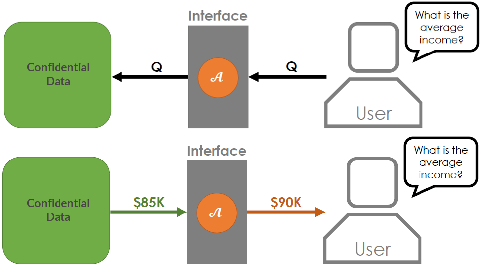
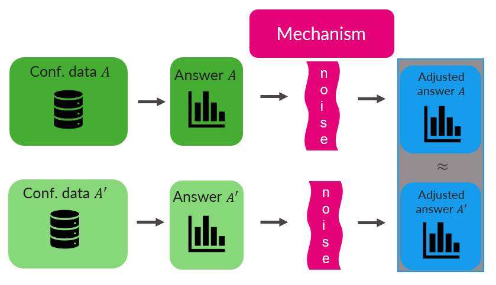
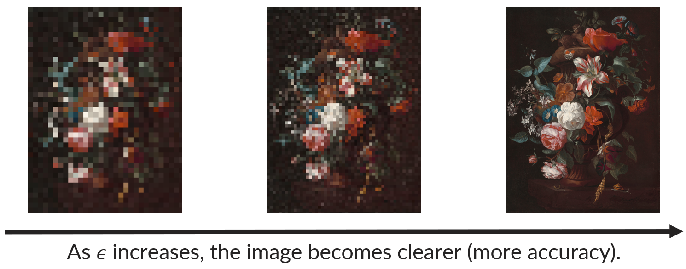
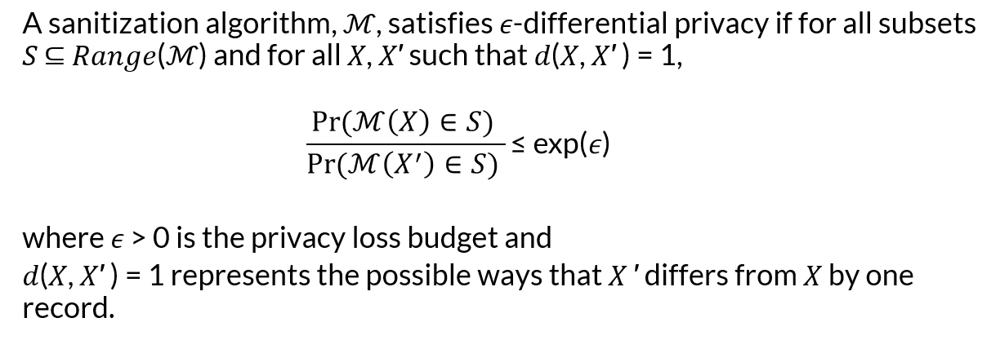
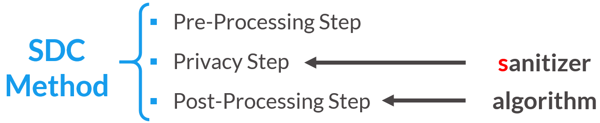
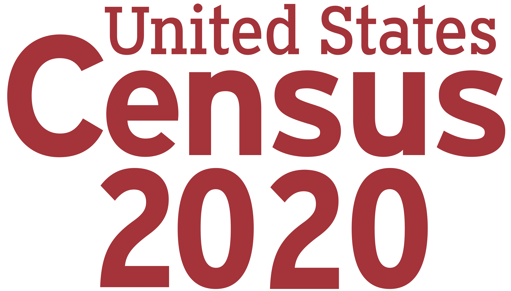
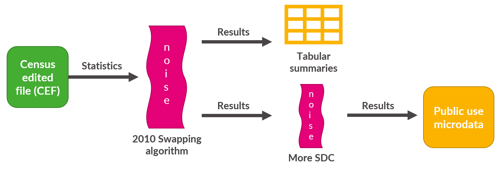
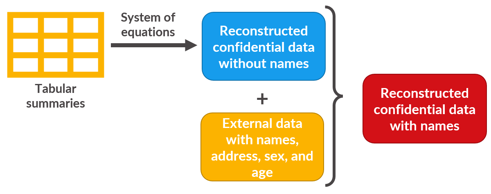
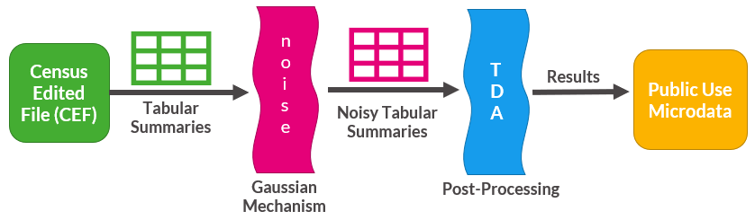
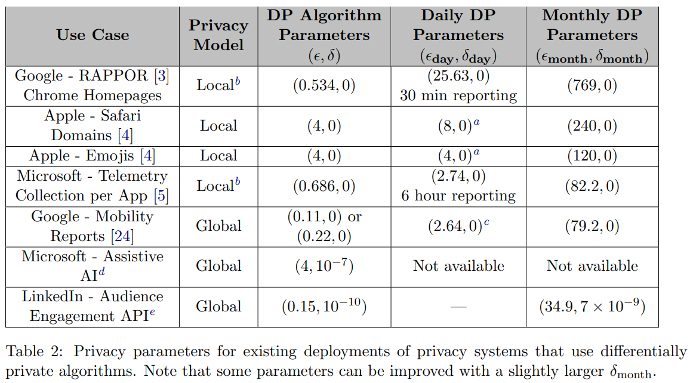

```{=html}
<style>
@import url('https://fonts.googleapis.com/css?family=Lato&display=swap');
</style>
```
<link rel="stylesheet" href="//fonts.googleapis.com/css?family=Lato" />

```{r header-image, fig.width = 5.14, fig.height = 1.46, echo = FALSE}
# All defaults
knitr::include_graphics(here::here('www', 'images', 'urban-institute-logo.png'))
```

# Formal Privacy vs. Traditional SDC

From the previous lessons, you might be asking yourself the following questions: How much disclosure risk is too much, and what type? When evaluating disclosure risk, what assumptions can be made about how the data intruder will approach the data? What about the resources the intruder has access to? Do these assumptions hold in the context of the specific, real-world application? 

These questions and many others motivated the creation of a concept known as **formal privacy**, which provides a mathematical bound on the disclosure risk for any statistic applied to the confidential data. Although methods developed within the formal privacy framework are considered SDC methods, data privacy researchers often separate formal privacy from other SDC methods. We will refer to the SDC methods and disclosure risk measures not developed under formal privacy as **traditional SDC methods** and **traditional disclosure risk definitions**.

In this part of the explainer, we will cover a high-level overview of formal privacy, differential privacy, and differentially private mechanisms. This summary will involve some mathematical intuition and present some mathematical equations to prepare the reader for the next section on how the 2020 DAS works.


# Definition of Formal Privacy

Although the privacy community has not fully agreed on a common definition, **formal privacy** is defined by the Census Bureau as a subset of SDC methods that give "formal and quantifiable guarantees on inference disclosure risk and known algorithmic mechanisms for releasing data that satisfy these guarantees" (Census Bureau 2022 p. 43).

Traits of formally private mechanisms include the following: 

- Ability to quantify and adjust the privacy-utility trade-off, typically through parameters. 

- Ability to rigorously and mathematically prove the maximum privacy-loss that can result from the release of information (Bowen and Garfinkel 2021). 

- Formal privacy definitions also allow one to **compose** multiple statistics. In other words, a data curator can compute the total privacy-loss from multiple individual information releases (Bowen and Garfinkel 2021). 

<br>

## Data Products

In most of the cases we've discussed so far, the released data product is a full dataset. However, a spectrum of data products could be released by a data curator after applying privacy methods.

Here are a list examples of possible data products that a data curator could release after applying SDC methods, roughly from most to least detailed:

- mmicrodata (e.g., public use microdata series or PUMS) 
- summary tables (e.g., American Community Survey tables) 
- summary statistics (e.g., multiple statistics on income in a state) 
- single statistics (e.g., maximum age in a county) 

Curators could release one of these products after applying a data privacy method, or they could release them "on demand", to answer different questions using the data. 

- Questions asked of the data are referred to in computer science terminology as **queries** or **statistics**. 

- The below image shows how the on-demand version of this process might work, with a user asking a question of the confidential data and receiving an answer that has been manipulated with algorithm $\mathcal{A}$. 

  - Note that while in the example the statistic in question is a single number, any of the above data products are available as potential output.



- Curators must consider how much noise should be added and how many statistics should be made available.

- If too many questions are answered with enough accuracy, all the data could be compromised (Bowen and Garfinkel 2021), so the type and number of questions asked of the data are limited by the curators.

For example, we can think of traditional SDC methods as akin to a someone charging a limitless credit card; formally private methods are akin to someone charging to a debit card with a set budget. In both scenarios, there is a running bill, but only one requires constantly checking the balance. We can easily imagine that not tracking that bill is the equivalent of releasing too many statistics with enough accuracy, which could compromise the confidential data (Bowen and Garfinkel 2021). Although in both traditional and formal privacy settings data curators must limit the type and number of questions asked of the data, they are faced with "tracking the bill" under a formal privacy framework. 


<br> <br>

# Differential Privacy

**Differential privacy (DP)** is just one type of formal privacy. 

- It is a strict mathematical definition that a method must satisfy (or meet the mathematical conditions) to be considered differentially private, not a statement or description of the data itself.

- Informally, DP does not make assumptions about how a data intruder will attack the data and the amount of external information or computing power an actor has access to, now or in the future.



- Curators control the strength of this privacy guarantee by adjusting the privacy loss budget.

<br>

## Privacy Loss Budget

Differential privacy uses the concept of a **privacy loss budget**, typically represented mathematically as $\epsilon$. The privacy-loss budget bounds the disclosure risk associated with releasing data or statistics. (Census Bureau 2022).

(*Note:* $\epsilon$ *is not the only privacy loss parameter, but we will use it here as a general representation of the privacy loss budget.*) 

The privacy loss budget can be thought of as a knob that adjusts the trade-off between data privacy and utility. Some things to keep in mind about the privacyloss budget are as follows: 

- The data curator must decide the privacy-loss budget (i.e., the total amount of 𝜖𝜖) before the release of any data or statistic. Like a real budget, when privacy-loss budget is exhausted, no more information from the confidential data is released.

- A larger value of $\epsilon$ increases the maximum disclosure risk (i.e., the upper bound of the disclosure risk) associated with a given release of information. Simply put,

  - larger $\epsilon$ = less noise potentially added to a statistic = more accuracy, but less privacy, and 
  
  - smaller $\epsilon$ = more noise potentially added to a statistic = less accuracy, but more privacy.
  


- Extreme cases (note that these cases are not realistic in the sense of real-world applications, but are presented to demonstrate the intuition):

  - $\epsilon \to \infty$
    - all privacy will be lost; data retains all utility, but no privacy
    - $\epsilon = \infty$ would indicate that no noise is added and the confidential data is released
    
  - $\epsilon \to 0$
    - no privacy is lost; data is completely distorted and no utility remains
    - $\epsilon = 0$ would indicate that no data is released

- Takeaway: disclosure risk can be adjusted by adjusting the privacy loss budget, but not eliminated. Adjusting the privacy loss budget is really about adjusting the strength of the privacy guarantee made by differential privacy.

<br>

## Who sets the privacy loss budget?

- This is very much still an open question, with implications for data stewards, researchers, and policymakers.

- Although policymakers are the most equipped to understand consequences of privacy loss, they are likely the least equipped to understand what $\epsilon$ means.


<br> <br>

# Differential Privacy Features

## Assumptions Underlying Privacy Guarantee

DP does not make assumptions about:

- how a data intruder will attack the data;

- the amount of external information or computing power an intruder has access to, now or in the future;

- which information in the data poses a higher disclosure risk (Near et al 2020).

Instead, DP assumes the worst-case scenario:

- the intruder has information on every observation except one;
  
- the intruder has unlimited computational power;
  
- missing observation is the most extreme possible observation (or an extreme outlier) that could alter the statistic.

<br>

## Mathematical Definition

As noted above, there are more formally private parameters than just $\epsilon$. We define $\epsilon$-differential privacy below in order to understand broad features of differential privacy, but this is by no means the only formally private definition.



Features to note:

- $\epsilon$ is logarithmic.
- This is an inequality, not an equation; $\epsilon$ is up to us to define and represents an upper bound for disclosure risk that we are comfortable with for our particular data.

<br>

## Composition

As differential privacy is a formally private method, differentially private statistics by definition must **compose**.

- **Composition** makes it possible to compute the total loss of privacy resulting from multiple releases of information.

  - For example, a data curator can track the total loss of privacy created by a summary table by summing the epsilon of the individual statistics.

  - Likewise, a data curator can track the total loss of privacy created by many users requesting statistics from a data set.

- Many "traditional" SDC methods cannot compose, so multiple releases of information can cause enormous privacy loss.

<br>

## Global Sensitivity

In addition to the privacy-loss budget, most differentially private methods rely on the concept called global sensitivity, which describes how resistant the differentially private sanitizer is to the presence of outliers (Bowen and Garfinkel 2021). We can think of the global sensitivity as another value that helps determine how much noise is needed to protect the released data or statistic, because some information is more sensitive than other information to outliers.
  
  - Consider a confidential dataset containing the names and respective wealth of members of the American population. Now consider two statistics generated from the confidential data: mean wealth and median wealth.
  
    - If we were to add Elon Musk to our dataset, mean wealth would change dramatically, while median wealth would remain consistent. 
    
    - A differentially private algorithm would have to add much less noise (assuming the same $\epsilon$) to compensate for the addition of Musk if the query was asking for median wealth rather than mean wealth.
  
<br>
  
**Global Sensitivity** is a term which describes how resistant the differentially private mechanism is to the presence of outliers (Bowen and Garfinkel 2021). 

- It is quantified by how the output must change to compensate for the addition of the most extreme possible record that could exist in the population (regardless of whether that record is actually present in the data).

- As in our Musk example above, the requested statistic in question can have a big impact on the sensitivity of the differentially private mechanism; in our example, mean wealth is much more sensitive than median wealth.

<br> <br>

# Demo - Laplace mechanism and epsilon

In this exercise, we're going to practice applying the Laplace mechanism by drawing from the Laplace distribution using varying values of sensitivity and epsilon.

Using the `laplace_mechanism()` function defined above (make sure you have run this code), vary the `epsilon` and `sensitivity` parameters. Some sample code is included below. Since we are not trying to reproduce these results, there is no need to set a seed.

```{r eval = FALSE}
# calculate noise
laplace_mechanism(sensitivity = #_____,
                  epsilon = #_____)
```

<br> 


## Question 1

Hold epsilon constant at 1 and adjust the sensitivity. What happens to the amount of noise added as the sensitivity goes up?

<br>

## Question 2

Hold sensitivity constant at 1 and adjust the epsilon. What happens to the amount of noise added as epsilon goes up?

<br> <br>

### Statistical Disclosure Control Method Steps

1. **Pre-Processing Step:** prioritizing which statistics or information to preserve (i.e., could be considered step 3 in the workflow).
2. **Privacy Step:** applying a sanitizer to the desired statistic or information (i.e., altering the statistic).
3. **Post-Processing Step:** ensuring the results of the statistic or information are consistent with realistic constraints (e.g., population counts should not be negative). 

**Fig. 2: Statistical Disclosure Control Terminology**
    {width="518"}
Note that in the privacy step, sanitizer is used with a lowercase “s”; some SDC methods use capitalized “Sanitizer” as part of their formal name. 

<br> <br>

-----

# Case Study
We will cover...

- **Motivation:** review the goal and context for the confidential data.
- **Data:** analyze the data features and structure.
- **Disclosure Risk:** state which privacy definition and sanitizer is used.
- **Utility Measures:** outline the utility metrics.
- **Statistical Disclosure Control Method:** identify what is done at each step in creating the differentially private synthetic data method.
- **Limitations:** discuss any limitations of the differentially private synthetic data method.

**Note:** Although the disclosure risk measures are different than synthetic data, we can use the same utility metrics as before to evaluate the quality of the differentially private synthetic data.

<br> <br>

## 2020 Decennial Census

{width="400"}


### Motivation

The decennial census data products affect how the United States apportion the 435 seats for the United States House of Representatives, redistrict voting lines, plan for natural disasters, and conduct many other purposes.

Because the US Census Bureau collects such detailed information about individuals, the 1929 Census Act requires the Census Bureau to alter decennial census data with privacy-preserving methods. Specifically, this act enforces that individuals and businesses cannot be identified in publicly released data. Since then, several laws have required the Census Bureau to protect census data products. The most cited law is Title 13 of the US Code, which protects individual-level data.

In addition to the legal requirements, some people might not be ethically comfortable with data users knowing certain characteristics of a group or area, such as where many people of certain racial groups live (e.g., Asian Americans, considering the legacy of internment camps during World War II and the racial prejudice and discrimination that recently accompanied the COVID-19 pandemic). On the other hand, data users, such as Asian American advocacy groups, might want access to such data to provide targeted services like financial support for Asian-owned businesses that struggled during the pandemic. This is another example of the tension between data privacy and data utility.

Why is the U.S. Census Bureau updating their disclosure avoidance system (DAS)?

The Census Bureau refers to the overall methodology to protect a census data product as the DAS. The last time US Census Bureau updated the decennial DAS was for the 1990 Census, by applying data swapping (figure below provides a summary of the 2010 DAS process). The Census Bureau periodically updates the DAS because the technological landscape is constantly evolving. For instance, modern smart phones have more computational power than the average desktop computer had in 2010. 


**Fig. 3: 2010 Disclosure Avoidance System Framework**

{width="800"}

- The technological landscape is constantly evolving. For instance, the tiny computers that fit in our pockets (i.e., smart phones) have more computational power than the average desktop in 2010. The last time Census Bureau updated DAS* was for the 1990 Census by applying data swapping (see Figure 3 for a summary of their process).

**Note:** DAS is the overall statistical disclosure control methodology that the Census Bureau applies to protect their data products.

- To reassess if the US Census Bureau needed to update the DAS, they conducted a database reconstruction attack. In other words, this type of attack evaluates whether too many independent statistics are published based on confidential data to recreate the underlying confidential data with little or no error. The Census Bureau tested this by:
    1. recreating the individual level 2010 Census (i.e., age, sex, race, and Hispanic or Non-Hispanic ethnicity for every individual in each census block) from nine summary tables, and then 
    2. uniquely identifying approximately one in six records using publicly available data, such as what could be found on social media profiles (Leclerc 2019). This rate is higher for smaller groups, such as underrepresented racial groups in rural areas. 
- Although the rate of reidentification from the 2010 Census is troubling, a potential data attacker could not confirm whether (1) a match was correct or (2) the reconstructed data were correct before the match without access to the Census Edited File, the confidential data that have been edited for mistakes. 

**Fig. 4: 2010 Census Reconstruction Attack Framework**

{width="800"}
    
For more information about the reconstruction attack: ["The Census Bureau's Simulated Reconstruction-Abetted Re-identification Attack on the 2010 Census" webinar materials](https://www.census.gov/data/academy/webinars/2021/disclosure-avoidance-series/simulated-reconstruction-abetted-re-identification-attack-on-the-2010-census.html).

**Note:** The U.S. Census Bureau has received criticism for their reconstruction attack. Ruggles and Van Riper (2021) claim that the US Census Bureau did not test whether identifying individuals through their reconstruction attack is more effective than a random guessing. Consider an analogy of clinical trials, where the experiment must have a control group to confirm whether people get better or not after a treatment. The authors describe the US Census Bureau’s reconstruction attack as using just a treatment group without a control group for comparison. Some people in the treatment group would get better regardless of whether they received a treatment, and some people could be identified regardless of whether they were included in the reconstruction attack.

### Data

**Fig. 5: U.S. Census Bureau Geographic Levels**

{width="600"}

The entire population of the United States of America.  The Census Bureau’s mission is "...to count everyone once, only once, and in the right place.” With this goal in mind, the US Census Bureau collects information on every person and household at various geographic levels for the United States. 

Note that the Census Bureau uses other important geographic levels not shown in the above figure, such as places, minor civil divisions, and American Indian and Alaska Native areas. We do not highlight these other areas because the US Census Bureau focuses on the geographic levels shown in the figure when protecting the data.

- The 2020 Census Questionnaire contains a total of twelve questions.
- A person’s answer is limited to the check boxes or fill in the blank boxes, restricting the possible outcomes.
- The form does not ask how the individuals within the household are related to anyone else filling out their own form.

### Disclosure Risk

- The Census Bureau used zero-concentrated differential privacy (zCDP), which can be converted to $(\epsilon, \delta)$-DP. This is why the U.S. Census Bureau reported the privacy parameter values as $\epsilon=17.14$ and $\delta = 10^{-10}$ for the persons file (Abowd et al., 2022; Bureau, 2021). 
- They used the Gaussian Mechanism as the sanitizer (i.e., adds Gaussian noise instead of Laplace noise).

### Utility Metrics

The Census Bureau checked for several things, such as, but not limited to:

- global metrics
  - mean absolute error
  - mean numeric error
  - root mean squared error
  - mean absolute percent error
  - coefficient of variation
  - total absolute error of shares
- specific metrics
  - decisions on redistricting voting lines or school districts
  - total absolute error of shares metric by county within each state as a share of that state, by incorporated place as a share of that state, and by minor civil divisions as a share of that state 
  
### Statistical Disclosure Control Method

Below is a summary of the method (Abowd et al., 2022; Bureau, 2021).

1. Pre-Processing Step: Calculate the crosstabulation of all variables for each geographic level (from states to census blocks).
  - 1 total count
  - 63 race, 2 ethnicity (Hispanic or Latino/Not Hispanic or Latino), 2 voting age (under 18 years/18 years and older) 
  - 3 institutional versus noninstitutional group quarter types 
  - 1 residential and 7 possible group quarter types for a total of 8 (e.g., dorms and prisons) 
  - 126 possible combinations of race and ethnicity 
  - 126 possible combinations of race and voting age
  - 4 possible combinations of ethnicity and voting age
  - 252 possible combinations of race, ethnicity, and voting age 
  - 2,016 possible combinations of race, ethnicity, and voting age at each residential and group quarter type
  
  For example, one of the possible statistics is the number of Asian Americans alone who are under 18 in a residential housing unit at the census tract level. 

2. Privacy Step: Essentially, the US Census Bureau applies the Gaussian mechanism to all the possible combinations listed earlier unless that combination has no observations (i.e., treat as a structural zero) at each geographic level.

3. Post-Processing Step: After adding noise to each statistic, the TopDown Algorithm is the procedure that enforces the invariant statistics (i.e., no change to the statistics) and constraints (e.g., the population counts in all counties in the state should equal the state population) listed below. Note that many refer to the 2020 DAS as the TopDown Algorithm even though the TopDown Algorithm only encompasses the postprocessing step. 
    - Invariant statistics
      - Total population in each state, the District of Columbia, and Puerto Rico
      - Total number of housing units within each census block
      - Number of group quarter facilities by type within each census block
    - Constraints:
      - Counts must be integers
      - Sums of rows and column margins must sum to the total populations
      - Counts must be consistent within tables, across tables, and across geographies
      - If there are zero housing units and zero group quarters at a geographic level, then no people may be assigned to that geography
      - Number of people in a group quarter is equal to or greater than 1
      - Number of people in a housing unit or group quarter is less than or equal to 99,999
      - Geographic areas cannot have everyone under the age of 18 except areas with certain group quarter populations (e.g., juvenile detention centers)
      - Census Edited File constraints (such as, if person two is the “natural child” of person one, then person two cannot be older than person one)


**Fig. 6: 2020 Disclosure Avoidance Framework**

{width="800"}

### Limitations

- The TDA is optimized to the block group level, which resulted in the Census Bureau advising census data users to not use block level information.
- Miscommunication has caused the data user community to be at odds with the U.S. Census Bureau disclosure avoidance system team.
- Although the Census Bureau selected a value for the privacy-loss parameters, what is considered an appropriate value for the privacy-loss parameters is still an open research question for practical applications.


<br> <br>

-----

# Takeaways and On-going Challenges

We learned the following:
- Unlike traditional SDC methods, formally private methods quantify and bound the disclosure risk associated with releasing information from the confidential data. Formal privacy definitions use the idea of a privacy-loss budget that adjust the amount of maximum disclosure risk (the upper bound of the disclosure risk) associated with releasing information from the confidential data.
  - larger $\epsilon$ = less noise potentially added to a statistic = more accuracy, but less privacy
  - smaller $\epsilon$ = more noise potentially added to a statistic = less accuracy, but more privacy
- How public policymakers set the privacy-loss budget is still an open question.
- Census data users must now answer the question, “How good is good enough?” and provide new utility measures and use cases to the US Census Bureau. 

## Setting the privacy-loss budget and other privacy parameters

The final two takeaways leave us with three major challenges. First, we do not have clear interpretations of the worst-case privacy-loss for the privacy parameters. Early DP literature considered $\epsilon=1$ or $\epsilon=2$ the upper bounds, whereas we are seeing larger values in more recent applications. Rogers et al. (2020) created the table below on what were the daily and monthly cost for various differentially private methods implemented in industry. The 2020 Census used $\epsilon=17.14$, which converts to a ratio of 27,784,809. However, in the table below, the largest value of $\epsilon$ is 769, which converts to a ratio rapidly approaching $\infty$.

**Fig. 7: Table from  Rogers et al. (2020)** 
{width="800"}

## More Applied Work

The second challenge is we need even more formally private use cases (and synthetic data use cases!). Although we have more use cases, part of the reason we do not know reasonable values for various privacy parameters is because most formally private research is still largely theoretical. More privacy researchers need to implement formally private methods on real-world applications to fully understand the privacy-utility trade-off under several conditions. For example, privacy experts should explore more small, practical differentially private applications rather than highly complicated, theoretical scenarios to better discern some of the data challenges and how we should address them. The same idea applies to other SDC methods, such as synthetic data, where we do not have enough use cases. 

## Improve Communication and Education

- **Lack of resources:**
  - Suppose someone told you that they had data that contained records of individuals, including demographics such as their age, their sex, and their race along with financial information. They want to explore applying machine learning methods to gain unique insights into the data. What resources would you recommend?
  
  - Now, suppose this person, with the same data, asked you how to apply data privacy and confidentiality methods. Before this course, would you have any idea what resources to recommend?
  
  - Likely, your response to these questions drastically varied!
  
Snoke and Bowen (2021) posed these scenarios and stated that "a significantly higher percentage of readers probably will have answers to the questions posed in the first hypothetical scenario than to those in the second, which raises the question of why. Statisticians often use public microdata or tables, or access sensitive data through restricted data centers or agreements. Yet, few develop and implement data privacy and confidentiality methods that enable that access."

- **Not enough tools:** Another challenge is having enough computational tools to implement the various SDC methods. While researchers should understand the basics of SDC methods, they do not necessarily need to thoroughly understand them.

- **Few people who are experts:** There are very few people who have the technical knowledge and the coding ability to implement SDC methods. Some propose that we need to teach the next generation of data privacy researchers. However, most higher education institutions do not provide data privacy courses. If they are taught, professors usually teach them at the graduate level in computer science departments, which is not representative of those who depend on and contribute to the field.

Hu and Bowen (2022) discuss these last points in further detail and suggested the following to advance the field.

- Incorporate data privacy and confidentiality into undergraduate curricula that goes beyond the basic introduction, such as applying appropriate methods to real data and evaluating their effectiveness.
- Take more of a presence in the space through research, teaching, and science communication. It often feels like 1 to 20 for statistics vs. computer science.
- Focus on how to translate theory to applications and deployment, rather than only the theory.
- Advocate for more funding for applied research and deployment (i.e., computational tools and educational resources), instead of only on new method development.

<br><br>

-----
# Suggested Reading
Bowen, CMK., Williams, A. R., & Pickens, M. 2021. "Personal Privacy and the Public Good: Balancing Data Privacy and Data Utility." Urban Institute (2021). [link](https://www.urban.org/research/publication/personal-privacy-and-public-good-balancing-data-privacy-and-data-utility)

# References

Bowen, C. M., & Garfinkel, S. (2021). Philosophy of differential privacy. Notices of the American Mathematical Society, 68 (10).
[link](https://www.ams.org/journals/notices/202110/rnoti-p1727.pdf)

Census Bureau. (2022). Consistency of data products and formally private methods for the 2020 census. [link](https://irp.fas.org/agency/dod/jason/census-privacy.pdf)

Near, J., Darais, D., & Boeckl, K. (2020). Differential privacy for privacy-preserving data analysis: an introduction to our blog series. [link](https://www.nist.gov/blogs/cybersecurity-insights/differential-privacy-privacy-preserving-data-analysis-introduction-our)

### 2020 Census

Leclerc, Philip. 2019."Results from a consolidated database reconstruction and intruder re-identification attack on the 2010 decennial census." In workshop" Challenges and New Approaches for Protecting Privacy in Federal Statistical Programs." [link](https://sites.nationalacademies.org/cs/groups/dbassesite/documents/webpage/dbasse_193509.pdf)

Garfinkel, S., Abowd, J. M., & Martindale, C. (2019). Understanding database reconstruction attacks on public data. Communications of the ACM, 62(3), 46-53. [link](https://www2.cs.sfu.ca/~mitchell/cmpt-827/2019-Fall/Readings/p46-garfinkel.pdf)

Ruggles, S., & Van Riper, D. (2022). The role of chance in the census bureau database reconstruction experiment. Population Research and Policy Review, 41(3), 781-788. [link](https://link.springer.com/article/10.1007/s11113-021-09674-3) 

Abowd, J. M., Ashmead, R., Cumings-Menon, R., Garfinkel, S., Heineck, M., Heiss, C., ... & Zhuravlev, P. (2022). The 2020 Census Disclosure Avoidance System TopDown Algorithm. arXiv preprint arXiv:2204.08986. [link](https://arxiv.org/abs/2204.08986)

Bureau, U.S. Census (2021). Disclosure avoidance for the 2020 census: An introduction. [link](https://www.census.gov/library/publications/2021/decennial/2020-census-disclosure-avoidance-handbook.html)

### Ongoing Challenges

Hu, J. & Bowen, C. M. (2022). Prescribing Privacy: Human and Computational Resource Limitations
. Amstat News.
[link](https://magazine.amstat.org/blog/2022/09/01/prescribing-privacy/)

Rogers, R., Subramaniam, S., Peng, S., Durfee, D., Lee, S., Kancha, S. K., ... & Ahammad, P. (2020). LinkedIn's Audience Engagements API: A privacy preserving data analytics system at scale. arXiv preprint arXiv:2002.05839. [link](https://arxiv.org/abs/2002.05839)

Snoke, J., & Bowen, C. M. (2020). How statisticians should grapple with privacy in a changing data landscape. Chance, 33(4), 6-13.
[link](https://www.tandfonline.com/doi/abs/10.1080/09332480.2020.1847947)

<br><br>


