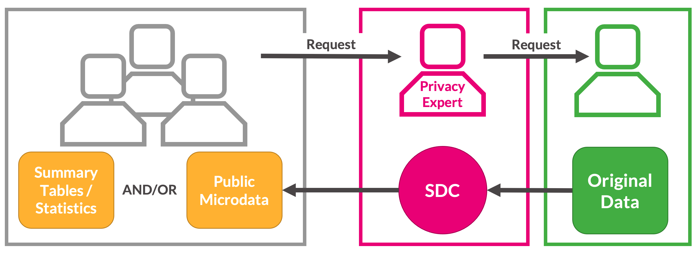
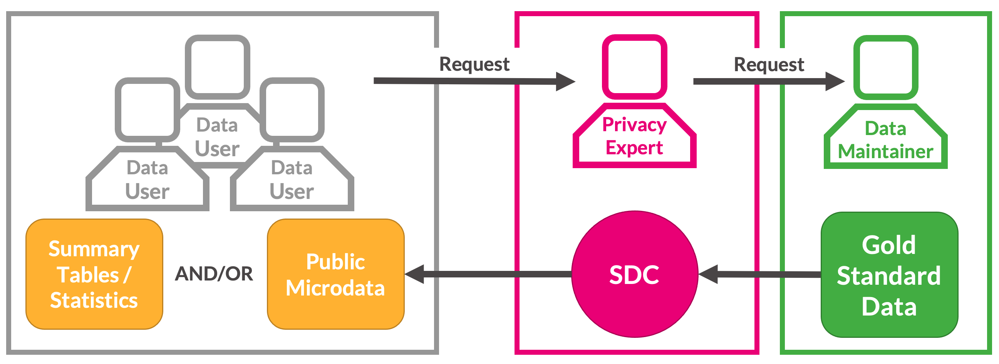

```{=html}
<style>
@import url('https://fonts.googleapis.com/css?family=Lato&display=swap');
</style>
```
<link rel="stylesheet" href="//fonts.googleapis.com/css?family=Lato" />

```{r header-image, fig.width = 5.14, fig.height = 1.46, echo = FALSE}

# All defaults
knitr::include_graphics(here::here("www", "images", "urban-institute-logo.png"))

```


```{r rmarkdown-setup, echo = FALSE}
knitr::opts_chunk$set(warning = FALSE)
knitr::opts_chunk$set(message = FALSE)
knitr::opts_chunk$set(echo = FALSE)
```

```{r setup}
options(scipen = 999)
library(tidyverse)
library(palmerpenguins)
library(kableExtra)
library(gt)


# Helper function to create nice gt tables
create_table <- function(data_df, 
                         rowname_col = NA,
                         fig_num = "",
                         title_text = ""){
  # random_id = random_id(n=10)
  random_id = "urban_table"
  
  basic_table = data_df %>% 
    gt(id = random_id, rowname_col = rowname_col) %>% 
    tab_options(#table.width = px(760),
                table.align = "left", 
                heading.align = "left",
                # TODO: Discuss with Comms whether border should extend across 
                # whole row at bottom or just across data cells
                table.border.top.style = "hidden",
                table.border.bottom.style = "transparent",
                heading.border.bottom.style = "hidden",
                # Need to set this to transparent so that cells_borders of the cells can display properly and 
                table_body.border.bottom.style = "transparent",
                table_body.border.top.style = "transparent",
                # column_labels.border.bottom.style = "transparent",
                column_labels.border.bottom.width = px(1),
                column_labels.border.bottom.color = "black",
                # row_group.border.top.style = "hidden",
                # Set font sizes
                heading.title.font.size = px(13),
                heading.subtitle.font.size = px(13),
                column_labels.font.size = px(13),
                table.font.size = px(13),
                source_notes.font.size = px(13),
                footnotes.font.size = px(13),
                # Set row group label and border options
                row_group.font.size = px(13),
                row_group.border.top.style = "transparent",
                row_group.border.bottom.style = "hidden",
                stub.border.style = "dashed",
                ) %>% 
    tab_header(
      title = fig_num,# "eyebrow",
      subtitle = title_text) %>%  #"Top 10 Banks (by Dollar Volume) for Community Development Lending") %>% 
    # Bold title, subtitle, and columns
    tab_style(
      style = cell_text(color = "black", weight = "bold", align = "left"),
      locations = cells_title("subtitle")
    ) %>% 
    tab_style(
      style = cell_text(color = "#696969", weight = "normal", align = "left", transform = "uppercase"),
      locations = cells_title("title")
    ) %>% 
    tab_style(
      style = cell_text(color = "black", weight = "bold", size = px(13)),
      locations = cells_column_labels(gt::everything())
    ) %>% 
    # Italicize row group and column spanner text
    tab_style(
      style = cell_text(color = "black", style = "italic", size  = px(13)),
      locations = gt::cells_row_groups()
    ) %>% 
    tab_style(
      style = cell_text(color = "black", style = "italic", size  = px(13)),
      locations = gt::cells_column_spanners()
    ) %>% 
    opt_table_font(
        font = list(
          google_font("Lato"),
          default_fonts()
        )
      ) %>% 
    # Adjust cell borders for all cells, small grey bottom border, no top border
    tab_style(
      style = list(
        cell_borders(
          sides = c("bottom"),
          color = "#d2d2d2",
          weight = px(1)
        )
      ),
      locations = list(
        cells_body(
          columns =  gt::everything()
          # rows = gt::everything()
        )
      )
    )  %>%
    tab_style(
      style = list(
        cell_borders(
          sides = c("top"),
          color = "#d2d2d2",
          weight = px(0)
        )
      ),
      locations = list(
        cells_body(
          columns =  gt::everything()
          # rows = gt::everything()
        )
      )
    )  %>%
    # Set missing value defaults
    fmt_missing(columns = gt::everything(), missing_text = "—") %>%
    # Set css for all the things we can't finetune exactly in gt, mostly t/r/b/l padding
    opt_css(
      css = str_glue("
      #{random_id} .gt_row {{
        padding: 5px 5px 5px 5px;
      }}
      #{random_id} .gt_sourcenote {{
        padding: 16px 0px 0px 0px;
      }}
      #{random_id} .gt_footnote {{
        padding: 16px 0px 0px 0px;
      }}
      #{random_id} .gt_subtitle {{
        padding: 0px 0px 2px 0px;
      }}
      #{random_id} .gt_col_heading {{
        padding: 10px 5px 10px 5px;
      }}
      #{random_id} .gt_col_headings {{
        padding: 0px 0px 0px 0px;
        border-top-width: 0px;
      }}
      #{random_id} .gt_group_heading {{
        padding: 15px 0px 0px 0px;
      }}
      #{random_id} .gt_stub {{
        border-bottom-width: 1px;
        border-bottom-style: solid;
        border-bottom-color: #d2d2d2;
        border-top-color: black;
        text-align: left;
      }}
      #{random_id} .gt_grand_summary_row {{
        border-bottom-width: 1px;
        border-top-width: 1px;
        border-bottom-style: solid;
        border-bottom-color: #d2d2d2;
        border-top-color: #d2d2d2;
      }}
      #{random_id} .gt_summary_row {{
        border-bottom-width: 1px;
        border-top-width: 1px;
        border-bottom-style: solid;
        border-bottom-color: #d2d2d2;
      }}
      #{random_id} .gt_column_spanner {{
        padding-top: 10px;
        padding-bottom: 10px;
      }}
      ") %>% as.character()
    )
  
  return(basic_table)
}
```


# Exercise 1 {.tabset .tabset-pills}

## Question

Fill in the grey and green blanks in the following diagram with the terms you learned above. There's also 1 mistake, see if you can spot it.

{width="544"}

<br>

<br>

## Solution

{width="542"}

<br>

<br>


# Exercise 2

Let's say a researcher generates a synthetic version of a dataset on penguins species. The first 5 rows of the gold standard dataset looks like this:

```{r}
set.seed(125)

ex_data = penguins %>% 
  select(species, bill_length_mm, sex) %>% 
  slice_sample(n = 5) 

ex_data %>% 
  create_table()
```

<br>

One of the metrics to assess data utility was the overall counts of penguin species across the synthetic and gold standard data, which look like this:

```{r}
set.seed(124)

penguins %>% 
  count(species) %>% 
  rowwise() %>% 
  mutate(`# synthetic data` = rnorm(n = 1, mean= n, sd = 10) %>% round(digits = 0)) %>% 
  rename(`# conf. data` = n) %>% 
  create_table()
```

<br>

<font color="#55b748">**Question 1:**</font> Would the above counts be considered a global utility metric or a specific utility metric and why?

<font color="#55b748">**Question 2:**</font> Researchers looked at telephone metadata, which included times, duration and outgoing numbers of telephone calls. They found that 1 of the records in the data placed frequent calls to a local firearm dealer that prominently advertises a specialty in the AR semiautomatic rifle platform. The participant also placed lengthy calls to the customer support hotline for a major firearm manufacturer which produces a popular AR line of rifles. Using publicly available data, they were able to confirm the participants identity and confirm that he owned an AR-15. In this example what kinds of disclosures happened? (Hint: there were two!)

<br> <br>

#  Exercise 3

### Implicates {.tabset}

#### <font color="#55b748">**Question**</font>

What are the privacy implications for releasing multiple versions of a synthetic dataset (implicates)? Do these implications change for partially vs. fully synthetic data?

<br> <br>

#### <font color="#55b748">**Question Notes**</font>

What are the privacy implications for releasing multiple versions of a synthetic dataset (implicates)? Do these implications change for partially vs. fully synthetic data?

-   Releasing multiple implicates improves transparency and analytical value, but increases disclosure risk (violates "security through obscurity").

-   It is more risky to release partially synthetic implicates, since non-synthesized records are the same across each dataset and there remains a 1-to-1 relationship between confidential and synthesized records.


<br> <br>

### Partial vs. fully synthetic {.tabset}

#### <font color="#55b748">**Question**</font>

What are the trade-offs of a partially synthetic dataset compared to a fully synthetic dataset?

<br> <br>

#### <font color="#55b748">**Question Notes**</font>

What are the trade-offs of a partially synthetic dataset compared to a fully synthetic dataset?


- **Changing only some variables (partial synthesis) in general leads to higher utility in analysis since the relationships between variables are by definition unchanged (Drechsler et al, 2008).**

- **Disclosure in fully synthetic data is nearly impossible because all values are imputed, while partial synthesis has higher disclosure risk since confidential values remain in the dataset (Drechsler et al, 2008).**
  
  - **Note that while the risk of disclosure for fully synthetic data is very low, it is not zero.**

- **Accurate and exhaustive specification of variable relationships and constraints in fully synthetic data is difficult and if done incorrectly can lead to bias.**
  
  - **If a variable is synthesized incorrectly early in a sequential synthesis, all variables synthesized on the basis of that variable will be affected.**

- **Partially synthetic data may be publicly perceived as more reliable than fully synthetic data.**

<br> <br>

# Exercise 4 {.tabset .tabset-pills}

## Question

Imagine you are in charge of safeguarding a dataset against an intruder. Brainstorm and discuss **features of the intruder** that you would consider a "worst-case scenario" in terms of privacy (short of the intruder having access to the entire confidential dataset).

<br> <br>

## Hints

- How much computational power might they have?
- Might they have access to other information about the observations?
- Might they have access to other, supplemental datasets?